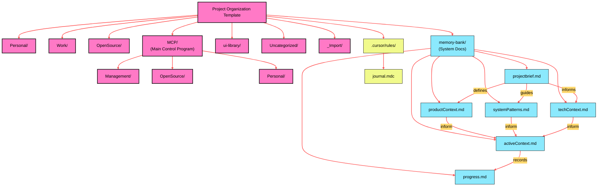

# Project Organization Template

Welcome! This repository serves as a template for structuring and managing diverse software development projects within a unified workspace. It provides a predefined directory structure, documentation guidelines, and a workflow for incorporating new projects efficiently.

## Workspace Overview

This template organizes projects into several top-level directories:

-   **`Work/`**: For repositories directly related to professional employment or contracts.
-   **`Personal/`**: For repositories concerning personal projects, experiments, or utilities not intended for open source or work.
-   **`OpenSource/`**: For repositories intended for public release, forks of public projects, or contributions to them.
-   **`MCP/`**: A specialized category for projects related to the Model Context Protocol (MCP). See sub-structure below.
-   **`ui-library/`**: For reusable UI components and design resources.
-   **`Uncategorized/`**: A temporary holding area for projects pending categorization.
-   **`_Import/`**: A staging directory for adding new repositories before sorting.
-   **`memory-bank/`**: Contains essential documentation defining the structure, rules, and context of *this organizational system itself*.
-   **`.cursor/rules/`**: Holds configuration or rule files for specific tools, like the Cursor IDE journal (`journal.mdc`).

## Workspace Visualization



### Project Workflow & Lifecycle

This template encourages a structured approach to project management, as visualized below. The specific implementation (e.g., using the `/sort_imports` command with an AI assistant) is detailed in the `AI_PROJECT_MANAGEMENT_GUIDE.md`.

```mermaid
%%{init: { 'theme': 'base', 'themeVariables': { 'primaryColor': '#8be9fd', 'primaryTextColor': '#000000', 'primaryBorderColor': '#00008b', 'lineColor': '#ff757f', 'secondaryColor': '#ffd86e', 'tertiaryColor': '#a9dc76' } } }%%
graph LR
    subgraph "Input"
        NewRepo["New Repository (Clone/Download)"] --> ImportDir["Place in _Import/"]
        ImportDir --> SortCmd["Trigger /sort_imports (Manual/AI)"]
    end

    subgraph "Categorization (Based on AI_PROJECT_MANAGEMENT_GUIDE.md)"
        direction TB
        SortCmd --> Analyze["Analyze Repo (README, Content)"]

        Analyze -- MCP? --> IsMCP{MCP Project?}
        IsMCP -- Yes --> MCPCat["Categorize within MCP/\n(Management, OpenSource, Personal)"]
        IsMCP -- No --> NonMCPCat["Categorize within Root/\n(Work, Personal, OpenSource, ui-library)"]

        Analyze -- Unsure --> UncatDir["Place in Uncategorized/ & Flag"]

        MCPCat --> Final["Move to Final Directory"]
        NonMCPCat --> Final
        UncatDir -.-> Final
    end

    subgraph "Documentation & Final State"
        Final --> VerifyREADME["Verify/Create README.md"]
        VerifyREADME --> UpdateDocs["Update Root README.md Tree (Optional)"]
        UpdateDocs --> Organized["Repository Organized"]
    end

    classDef action fill:#ffb86c,stroke:#000000,stroke-width:1px,color:#000000;
    classDef decision fill:#bd93f9,stroke:#000000,stroke-width:1px,color:#000000;
    classDef location fill:#50fa7b,stroke:#000000,stroke-width:1px,color:#000000;
    classDef doc fill:#8be9fd,stroke:#000000,stroke-width:1px,color:#000000;

    class NewRepo, ImportDir, SortCmd, Analyze, MCPCat, NonMCPCat, Final, VerifyREADME, UpdateDocs action;
    class IsMCP decision;
    class UncatDir, Organized location;
    class AI_PROJECT_MANAGEMENT_GUIDE doc;

    linkStyle default stroke:#ff79c6,stroke-width:1.5px;
```

## Getting Started

1.  **Use as Template:** Click the "Use this template" button on GitHub (after this repo is configured as such) to create a new repository based on this structure.
2.  **Clone:** Alternatively, clone this repository directly.
3.  **Review Guides:** Familiarize yourself with the `AI_PROJECT_MANAGEMENT_GUIDE.md` for detailed categorization rules and the `memory-bank/` files for the system's rationale.
4.  **Import Projects:** Place new repositories into the `_Import/` directory and follow the sorting workflow described in the guide.

## Template Directory Structure

This is the base structure provided by the template:

```
.
├── .cursor/
│   └── rules/
│       └── journal.mdc         # Rules/Journal for Cursor AI (Example)
├── MCP/
│   ├── Management/
│   │   └── .gitkeep            # Empty dir placeholder
│   ├── OpenSource/
│   │   └── .gitkeep            # Empty dir placeholder
│   └── Personal/
│       └── .gitkeep            # Empty dir placeholder
├── OpenSource/
│   └── .gitkeep                # Empty dir placeholder
├── Personal/
│   └── .gitkeep                # Empty dir placeholder
├── Uncategorized/
│   └── .gitkeep                # Empty dir placeholder
├── Work/
│   └── .gitkeep                # Empty dir placeholder
├── _Import/
│   └── .gitkeep                # Empty dir placeholder
├── memory-bank/
│   ├── activeContext.md
│   ├── productContext.md
│   ├── progress.md
│   ├── projectbrief.md
│   ├── systemPatterns.md
│   └── techContext.md
├── ui-library/
│   └── .gitkeep                # Empty dir placeholder
├── .gitignore                  # Git ignore patterns
├── AI_PROJECT_MANAGEMENT_GUIDE.md # Core rules for organization
└── README.md                   # This file
```
*(Note: `.gitkeep` files are used to ensure empty directories are tracked by Git. They can be removed once a directory contains other files.)*

## Key Documentation

-   **[AI Project Management Guide](./AI_PROJECT_MANAGEMENT_GUIDE.md)**: The core rulebook defining the categories and workflow. **Read this first.**
-   **[Memory Bank](./memory-bank/)**: Contains the "meta-documentation" about *this organizational template itself* – its purpose, design, and context.
    -   `projectbrief.md`: High-level goals and scope of the template.
    -   `productContext.md`: The "why" behind this structure.
    -   `systemPatterns.md`: Design decisions and patterns used.
    -   `techContext.md`: Technical assumptions and dependencies.
    -   `activeContext.md` & `progress.md`: Intended to track the evolution *of your instance* after using the template.
-   **[.cursor/rules/journal.mdc](./.cursor/rules/journal.mdc)**: An example journal file for use with Cursor AI, capturing patterns observed in *your usage* of the template.

## Contributing

While this is a template, if you find ways to improve the base structure or documentation, contributions (e.g., via Pull Requests if hosted publicly) are welcome according to standard community practices. Consider adding:

-   A `CONTRIBUTING.md` file outlining how others can contribute.
-   A `CODE_OF_CONDUCT.md` file.
-   Issue and Pull Request templates (`.github/` directory).

## License

Consider adding a `LICENSE` file (e.g., MIT, Apache 2.0) to define how others can use this template.